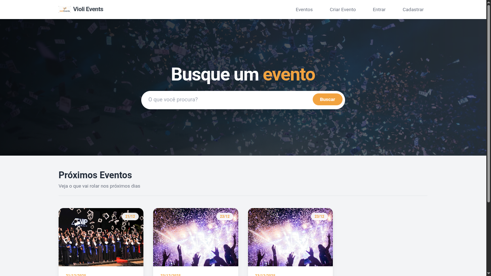
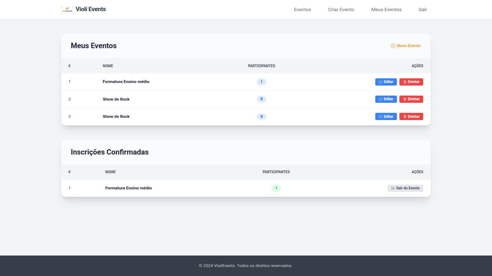
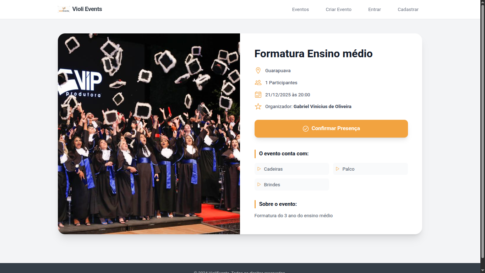
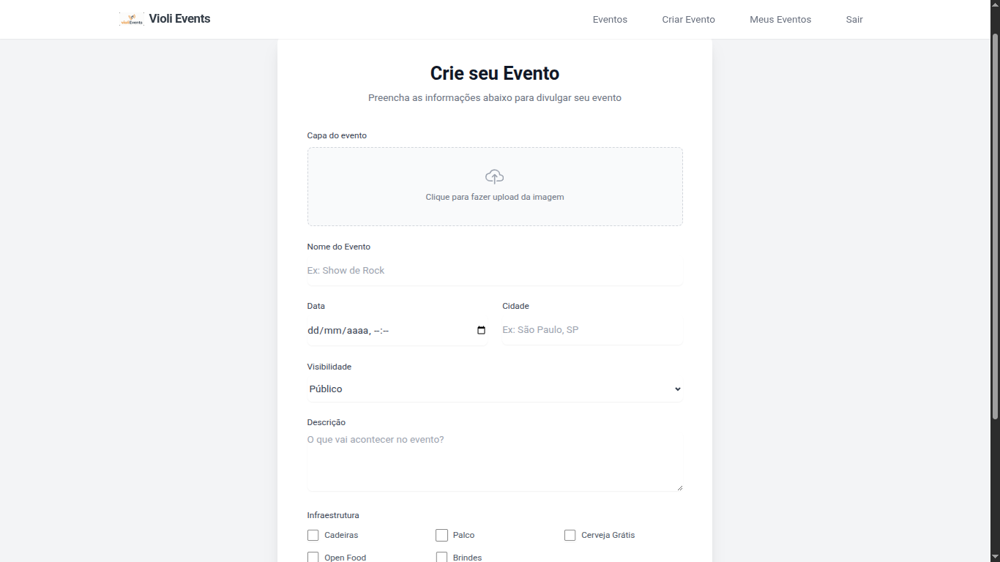
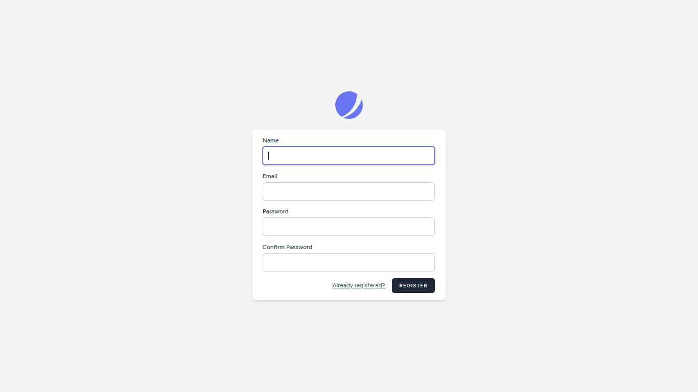

# VioliEvents 

O **VioliEvents** é uma plataforma completa de gerenciamento de eventos. O sistema permite que usuários se cadastrem, criem seus próprios eventos (com upload de imagens e definição de infraestrutura) e confirmem presença em eventos de outros organizadores.

O foco do projeto é a construção de uma aplicação robusta utilizando o ecossistema Laravel, implementando autenticação, relacionamentos complexos de banco de dados (Many-to-Many) e um front-end responsivo.

## Tecnologias Utilizadas

* **PHP 8.2+**
* **Laravel 11** (Framework MVC)
* **MySQL** (Banco de dados relacional)
* **Blade Templates** (Motor de renderização)
* **Tailwind CSS** (Estilização moderna e responsiva)
* **JavaScript** (Interatividade e preview de imagens)

## Funcionalidades

* **Autenticação Completa:** Login, Registro e Logout seguros.
* **CRUD de Eventos:** Criação, Leitura, Edição e Exclusão de eventos.
* **Upload de Imagens:** Gerenciamento de arquivos de mídia para capas dos eventos.
* **Sistema de Presença (N:N):** Usuários podem participar de eventos (Join) e sair deles (Leave).
* **Dashboard:** Área administrativa para visualizar "Meus Eventos" e "Eventos que participo".
* **Busca:** Sistema de pesquisa de eventos por nome.
* **Design Responsivo:** Layout adaptável para mobile e desktop.

## Screenshots

Aqui estão algumas telas do projeto em funcionamento:

### Página Inicial (Home)
Visualização dos próximos eventos e campo de busca.

### Dashboard do Usuário
Gerenciamento dos eventos criados e das inscrições confirmadas.

### Detalhes do Evento
Visualização completa das informações, infraestrutura e botão de confirmar presença.

### Criar Evento
Formulário para cadastro de novos eventos com upload de imagem.

### Registro de Usuário
Tela de cadastro para novos membros.

## Créditos

Este projeto foi desenvolvido com base no curso "Laravel" do **Matheus Battisti (Hora de Codar)**.

O código original foi refatorado e expandido por mim para incluir:
- Migração completa do front-end para **Tailwind CSS**.
- Implementação de Design System moderno.
- Melhorias na Experiência do Usuário (UX) com feedback visual e JavaScript.

---
Desenvolvido por **Gabriel Vinícius**
